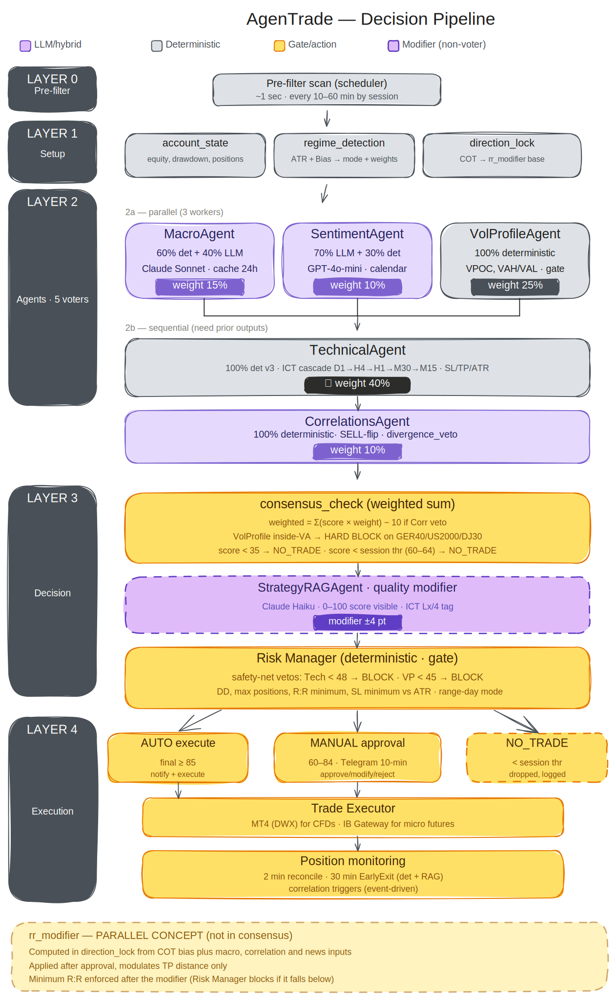

# AgenTrade — Production Multi-Agent LLM Trading System

A production multi-agent system that routes trading decisions through five specialised agents, combining deterministic rule engines with selective LLM augmentation. Architecture case study published on SSRN: *[link — forthcoming]*.

!--  -->

---

## Key Design Decisions

### 1. LLM where ambiguity is real, determinism where rules are real
Two agents — TechnicalAgent and RiskManagerAgent — had their LLM components removed entirely in v3. The ICT/SMC pattern detection logic is fully deterministic: either a BOS occurred at a specific price level or it did not. Asking a language model to decide adds latency and cost without improving correctness. The LLM is retained only where genuine ambiguity exists: interpreting central bank tone (MacroAgent) and evaluating setup quality against a strategy knowledge base (StrategyRAGAgent). See paper Section 3.5c.

### 2. Score normalisation at the boundary
All five agents produce native scores on different ranges (MacroAgent ±20, VolProfileAgent 0-8 quality points, CorrelationsAgent ±10). A single `to_score_0_100()` utility in `utils/score_converter.py` converts every raw score to a 0-100 range before the weighted consensus is computed. This keeps each agent's internal logic independent of the consensus formula, and makes the normalisation boundary explicit and testable. See paper Section 3.4.

### 3. Broker-asymmetric position lifecycle
MT4 CFD and IB Micro Futures have fundamentally different execution capabilities. MT4 supports partial close at the broker level; IB Micro Futures trade in whole contracts. Rather than abstracting this difference away, AgenTrade models it explicitly: MT4 positions follow a SINGLE_TP_PARTIAL lifecycle (60% closed at TP1, 40% runner to TP2), while IB positions follow a SINGLE_TP lifecycle with breakeven shift. The abstraction lives in `RiskManagerAgent._calculate_tp_levels()` and `broker/base_broker.py`. See paper Section 3.1.

### 4. ContFuture for automatic rollover
IB Micro Futures (MES, MGC, MCL, 6E) use `ContFuture` contracts via ib_insync, which resolve to the current front-month automatically. This eliminates the need to hardcode `conId` values that expire every quarter — a common production failure mode for quarterly-rolling futures. See paper Section 3.7 and `broker/ib_datafeed.py`.

---

## Architecture

The pipeline runs sequentially/in parallel across eight nodes in a LangGraph graph:

```
account_state_node
    ↓
regime_detection_node     ← ATR ratio → mode (intraday / swing) + weights
    ↓
direction_lock_node       ← COT extreme check → rr_modifier contribution
    ↓
┌──────────────────────────────────────┐
│  MacroAgent  │ SentimentAgent  │ VolProfileAgent  │  ← parallel
└──────────────────────────────────────┘
    ↓
TechnicalAgent            ← produces SL/TP levels for downstream agents
    ↓
CorrelationsAgent
    ↓
consensus_check_node      ← weighted score 0-100, mode-specific weights
    ↓
StrategyRAGAgent          ← quality_delta ±2/±1/0
    ↓
RiskManagerAgent          ← APPROVE / BLOCK / MODIFY
    ↓
telegram_dispatch_node
```

**Decision thresholds:**
- `consensus ≥ 85` → AUTO-EXECUTE (Telegram notification only)
- `60 ≤ consensus < 85` → MANUAL APPROVE (5-min Telegram timeout)
- `consensus < 60` → NO_TRADE (workflow terminates)

---

## Stack

| Component | Technology |
|---|---|
| Orchestration | Python 3.12 · LangGraph |
| LLM — Macro qualitative | Claude Sonnet (Anthropic) |
| LLM — Strategy RAG | Claude Haiku (Anthropic) |
| LLM — Sentiment | GPT-4o-mini (OpenAI) |
| Technical analysis | Fully deterministic (no LLM) |
| Risk management | Fully deterministic (no LLM) |
| Broker MT4 | DWX ZeroMQ connector |
| Broker IB | IB Gateway · ib_insync |
| Data — historical | MT4 DWX → tvdatafeed → yfinance |
| Data — IB futures | IB native (real volume) |
| Data — macro | FRED API · ForexFactory · Central bank RSS |
| Database | PostgreSQL · Redis |
| Vector DB | Qdrant |
| Notifications | Telegram Bot API |

---

## Repository Structure

```
agentrade-public/
├── orchestrator/
│   ├── graph.py          # LangGraph pipeline (full structure)
│   ├── scheduler.py      # scan loop, session detection, pre-filter gate
│   ├── state.py          # AgentState TypedDict definition
│   ├── pre_filter.py     # pre-filter logic
│   └── atr_regime.py     # ATR regime detection, mode weights
│
├── agents/
│   ├── base_agent.py         # abstract base class, AgentResult
│   ├── macro_agent.py        # PARTIAL — FRED + COT real; Claude prompt stub
│   ├── sentiment_agent.py    # STUB — RSS collection real; GPT call stub
│   ├── technical_agent.py    # PARTIAL — interface real; strategy_rules excluded
│   ├── vol_profile_agent.py  # REAL — VPOC/VAH/VAL math + Value Area gate
│   ├── correlations_agent.py # PARTIAL — cluster definitions real; deterministic v3
│   ├── strategy_rag_agent.py # STUB — ICT chain logic real; Qdrant/Claude stub
│   └── risk_manager_agent.py # REAL — all deterministic gates visible
│
├── agents/web_context/       # STUB — web scrapers for MacroAgent (FED/ECB/EIA/crypto); not published
│
├── broker/
│   ├── base_broker.py        # abstract broker interface
│   ├── [mt4_broker.py]       # EXCLUDED — DWX ZeroMQ execution layer (not published)
│   ├── ib_connector.py       # IB Gateway via ib_insync
│   ├── ib_datafeed.py        # persistent IB datafeed (micro futures, real volume)
│   ├── mt4_datafeed.py       # MT4 historical data via DWX
│   └── data_cache.py         # OHLCV cache: MT4 DWX → tvdatafeed → yfinance
│
├── utils/
│   ├── score_converter.py    # to_score_0_100() — normalisation at boundary
│   ├── lot_spec.py           # lot rules per broker symbol
│   ├── mt4_lock.py           # asyncio locks for DWX ZeroMQ concurrency
│   └── yfinance_lock.py      # threading lock for yfinance thread-safety
│
├── tests/                    # pytest test suite
├── docs/                     # decision records and architecture diagrams
├── .env.example              # all environment variables with placeholder values
└── requirements.txt
```

---

## Repository Notes

This is a **sanitized showcase version**. The following are intentionally excluded:

- `agents/strategy_rules.py` — proprietary ICT/SMC detection logic (BOS, CHoCH, OB, FVG, MSS, Judas Swing, MMXM detection rules)
- `agents/web_context/` — web scrapers for MacroAgent (FED/ECB/EIA/crypto context feeds); only `__init__.py` is present
- `broker/mt4_broker.py` — MT4 order execution layer (DWX ZeroMQ); not published
- Claude prompt templates for MacroAgent qualitative analysis
- Production configuration (weights, thresholds, account parameters)
- Qdrant vector database contents

The paper linked above documents all design decisions in full. The deterministic components (VolProfileAgent, RiskManagerAgent, CorrelationsAgent v3, TechnicalAgent scoring architecture) are published in their entirety.

---

## Quickstart

```bash
git clone https://github.com/YOUR_USERNAME/agentrade-public
cd agentrade-public
pip install -r requirements.txt
cp .env.example .env
# Fill in your API keys and broker connection details
pytest tests/
```

---

## Paper

*AgenTrade: A Production Multi-Agent LLM System for Algorithmic Trading — Architecture, Cost Reduction, and Deterministic Safety Nets*  
SSRN: [forthcoming]
